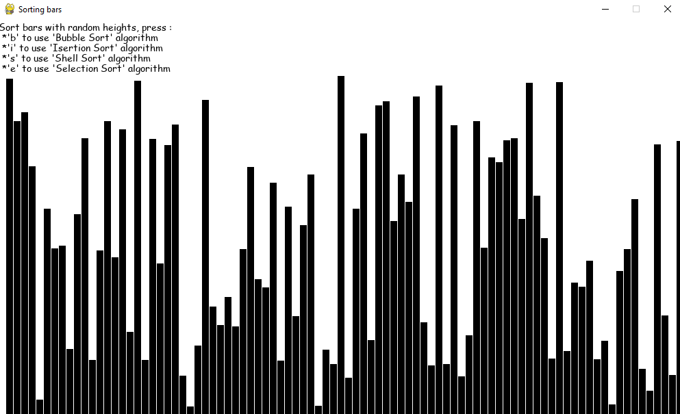
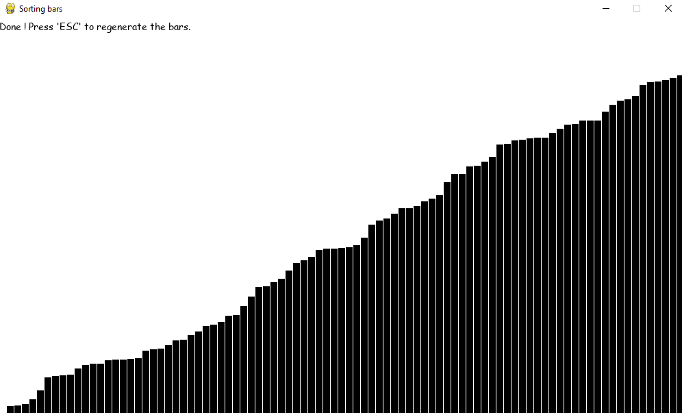

# Sorting random bars

Dev. by : Rad-Wane  


## Intro:

This visual program uses sevral algorthims to sort bars with random heights. You can choose to sort using one of the 4 algorithms, and you'll get a visual on how those algorithms work. You can also regenerate the random bars and sort them again and again.   

## Screen shots:

Before                     | After
:-------------------------:|:-------------------------:
            |  

## The algorithms used : 
You can choose on of the folowing :
* Bubble Sort
* Insertion Sort
* Shell Sort
* Selection Sort

### Bubble Sort

It is a comparison-based algorithm in which each pair of adjacent elements is compared and the elements are swapped if they are not in order.
```python
def bubblesort(list):

# Swap the elements to arrange in order
    for iter_num in range(len(list)-1,0,-1):
        for idx in range(iter_num):
            if list[idx]>list[idx+1]:
                temp = list[idx]
                list[idx] = list[idx+1]
                list[idx+1] = temp


list = [19,2,31,45,6,11,121,27]
bubblesort(list)
print(list)
```
When the above code is executed, it produces the following result −
```
[2, 6, 11, 19, 27, 31, 45, 121]
```

### Insertion Sort

Insertion sort involves finding the right place for a given element in a sorted list. So in beginning we compare the first two elements and sort them by comparing them. Then we pick the third element and find its proper position among the previous two sorted elements. This way we gradually go on adding more elements to the already sorted list by putting them in their proper position.
```python
def insertion_sort(InputList):
    for i in range(1, len(InputList)):
        j = i-1
        nxt_element = InputList[i]
# Compare the current element with next one
        
        while (InputList[j] > nxt_element) and (j >= 0):
            InputList[j+1] = InputList[j]
            j=j-1
        InputList[j+1] = nxt_element

list = [19,2,31,45,30,11,121,27]
insertion_sort(list)
print(list)
```
When the above code is executed, it produces the following result −
```
[2, 11, 19, 27, 30, 31, 45, 121]
```

### Shell Sort

Shell Sort involves sorting elements which are away from ech other. We sort a large sublist of a given list and go on reducing the size of the list until all elements are sorted. The below program finds the gap by equating it to half of the length of the list size and then starts sorting all elements in it. Then we keep resetting the gap until the entire list is sorted.
```python
def shellSort(input_list):
    
    gap = len(input_list) // 2
    while gap > 0:

        for i in range(gap, len(input_list)):
            temp = input_list[i]
            j = i
# Sort the sub list for this gap

            while j >= gap and input_list[j - gap] > temp:
                input_list[j] = input_list[j - gap]
                j = j-gap
            input_list[j] = temp

# Reduce the gap for the next element

        gap = gap//2

list = [19,2,31,45,30,11,121,27]

shellSort(list)
print(list)
```
When the above code is executed, it produces the following result −
```
[2, 11, 19, 27, 30, 31, 45, 121]
```

###Selection Sort

In selection sort we start by finding the minimum value in a given list and move it to a sorted list. Then we repeat the process for each of the remaining elements in the unsorted list. The next element entering the sorted list is compared with the existing elements and placed at its correct position. So at the end all the elements from the unsorted list are sorted.
```python
def selection_sort(input_list):

    for idx in range(len(input_list)):

        min_idx = idx
        for j in range( idx +1, len(input_list)):
            if input_list[min_idx] > input_list[j]:
                min_idx = j
# Swap the minimum value with the compared value

        input_list[idx], input_list[min_idx] = input_list[min_idx], input_list[idx]


l = [19,2,31,45,30,11,121,27]
selection_sort(l)
print(l)
```
When the above code is executed, it produces the following result −
```
[2, 11, 19, 27, 30, 31, 45, 121]
```